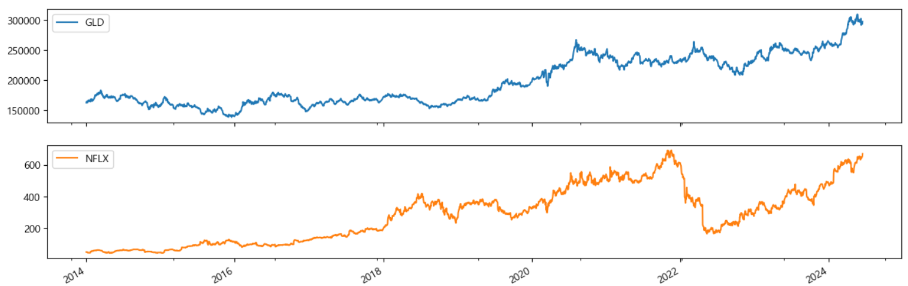
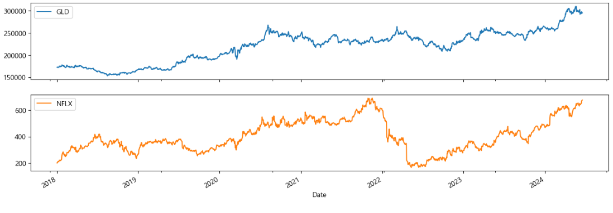
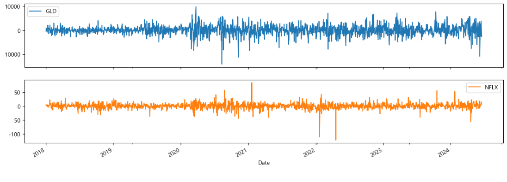

# **넷플릭스 주가 분석 및 예측**

다음은 2014 ~ 2024년을 기준으로본 넷플릭스(Netflix)와 금 펀드(GLD)이다.  
2018년을 기점으로 넷플릭스가 시가 총액 1,000억을 달성하며 상승세를 타기 시작했고,  
2019년 코로나19를 지나며 크게 상승한 것을 볼 수 있다.  
해당 데이터는 상승세가 보이는 2018년을 기준으로 현 시점까지 데이터를 추출한다.

---

## **데이터 분석**

**1. 2018 - 2024 넷플릭스와 금 펀드의 주가 시각화**

-   GLD와 Netflix 모두 전체적으로 상승세를 보이고 있다.
-   시대의 발전에 따라 2018년 이후 Netflix는 전체적으로 상승세를 보이고 있으나, 2018년 말, 2020년 초, 2022년 중반 하락한 모양을 보여준다.
-   2018년 말 코로나 19의 영향으로 경제가 하락함에 따라 하락세를 보였을 것이라 추정
-   2020년 초, 멤버십 요금제를 발표하면서 고객의 반발이 있었음
-   2021년 후반, 오징어게임이 에미상에서 미국 드라마로 인정받음과 동시에 6관왕을 차지 국내외로 넷플릭스가 흥행 (상승요인으로 추정)
-   2022년 중반, 코로나 19의 종식에 따라 많은 사용자들이 외부 활동을 시작하면서 하락했을 것이라고 추정

**2. 차분 후 주가 시각화**

